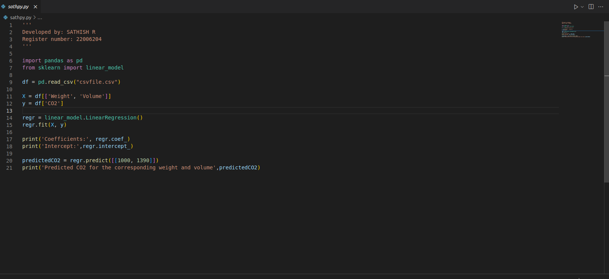
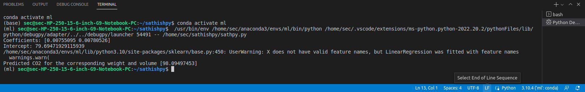

# Implementation of Multivariate Linear Regression
## Aim
To write a python program to implement multivariate linear regression and predict the output.
## Equipment’s required:
1.	Hardware – PCs
2.	Anaconda – Python 3.7 Installation / Moodle-Code Runner
## Algorithm:
### Step1
import pandas as pd

### Step2
read the csv file

### Step3
get the values of X and Y variables

### Step4
create the linear regression model and fit

### Step5
Predict the CO2 emission of a car where the weight is 2300kg, and the volume is 1300cm cube.

### Step5
print the predicted output

## Program:
```
'''
Developed by: SATHISH R 
Register number: 22006204
'''

import pandas as pd
from sklearn import linear_model

df = pd.read_csv("csvfile.csv")

X = df[['Weight', 'Volume']]
y = df['CO2']

regr = linear_model.LinearRegression()
regr.fit(X, y)

print('Coefficients:', regr.coef_)
print('Intercept:',regr.intercept_)

predictedCO2 = regr.predict([[1000, 1390]])
print('Predicted CO2 for the corresponding weight and volume',predictedCO2)

```
## Output:

### Insert your output



## Result
Thus the multivariate linear regression is implemented and predicted the output using python program.